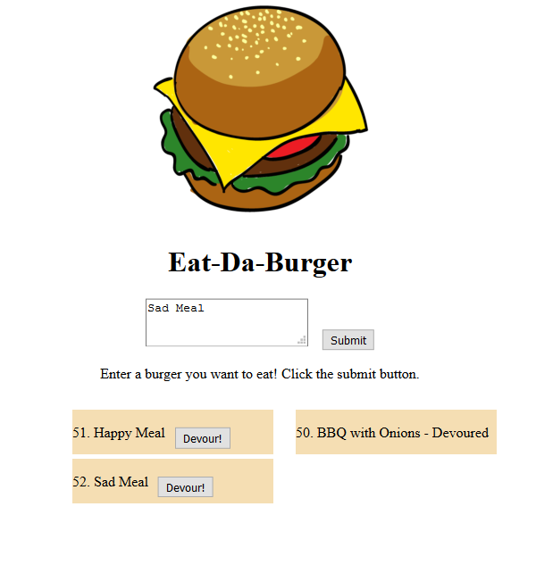

# A Burger Managing app - Developed with MVC architecture

### A Full-Stack Node, Express, Handlebars, and MySQL web-app to create and devour tasty burgers created by the user.

### Live Demo
https://blooming-brook-63608.herokuapp.com

## Installation:
1. Clone repo to your local machine
2. Run "npm install" in the directory of the cloned repo
3. Create and run a MySQL DB using the provided schema.
4. Run "node server.js" to spawn the web-app at localhost:8080

## This repo contains:
* An MVC stucture
* An Express web server
* A MySQL schema for storing burger information
* Handlebars-run front end
* A Home-made ORM 
* URL routing 
* Vanilla CSS 

## Known Issues / Bugs
* N/A

## What I Learned:
* Developing for your local machine is easy. Pushing that same code out to a hosting service can be a nightmare if you aren't aware of the setup required to migrate your project.
* Using an MVC styled project makes file management infinitely more efficient, and compartmentalizing everything makes it easier to see where you might have made a mistake in your code.

## Dependencies:
* [Express 4.17.1](https://www.npmjs.com/package/express)
* [Handlebars 3.1.0](https://www.npmjs.com/package/handlebars)
* [MySQL 2.18.1](https://www.npmjs.com/package/mysql)

